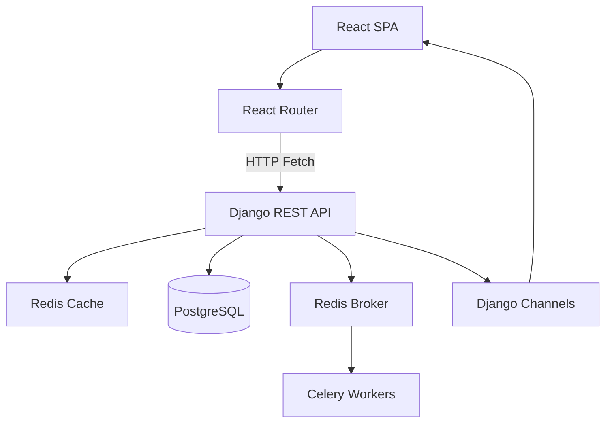
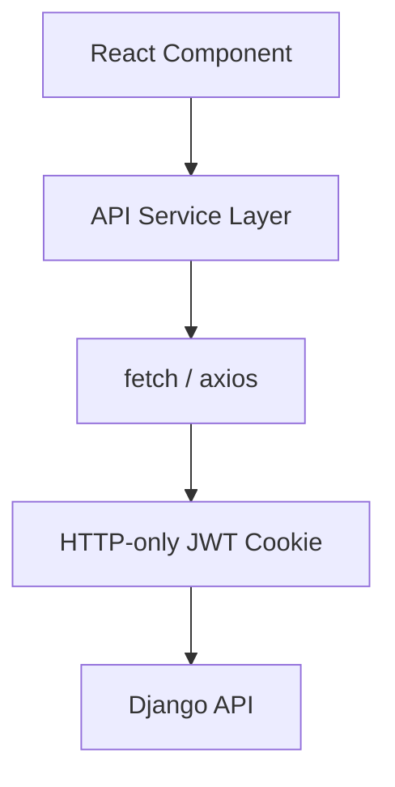
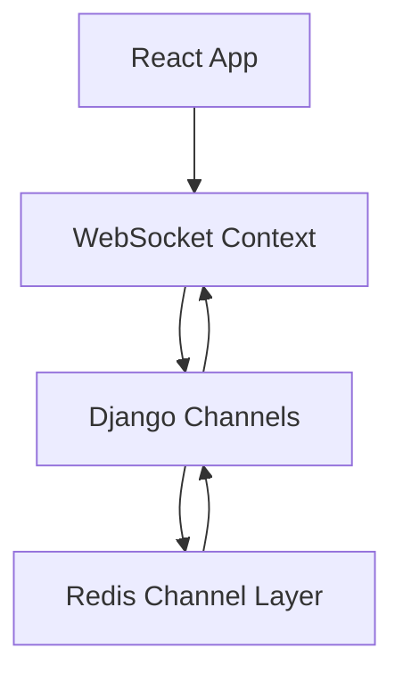
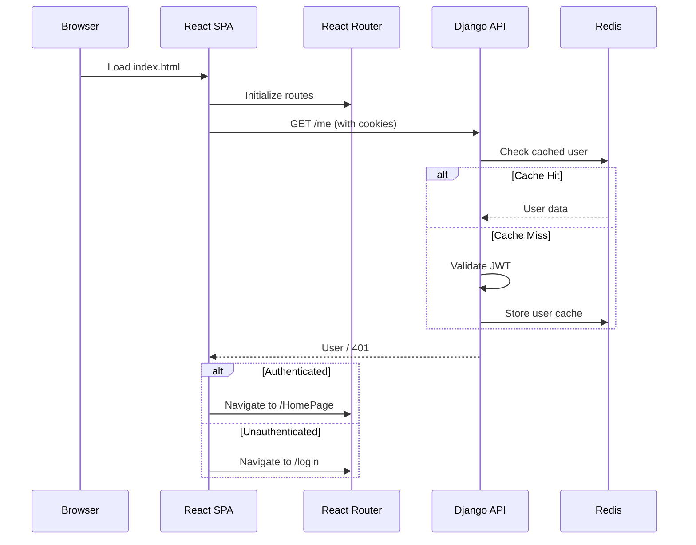
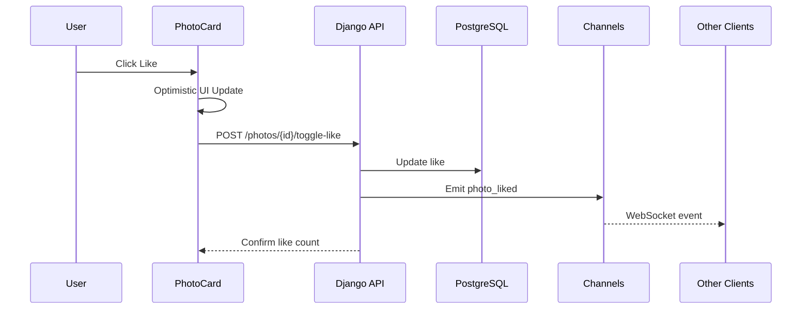
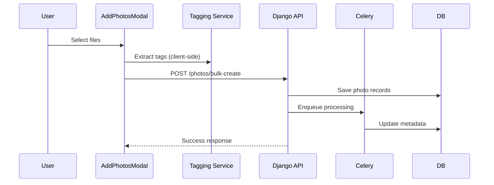

# KeepEvents Backend (Django REST + Realtime)

## Table of Contents
1. Overview
2. Key Features
3. High-Level Architecture
4. Detailed Architecture Breakdown
5. Authentication & Authorization Model
6. Core Domain Models
7. API Modules & Responsibilities
8. Realtime & Asynchronous Processing
9. Caching Strategy
10. Security Considerations
11. Setup & Installation
12. Environment & Configuration
13. Database & Migrations
14. Running the System
15. API Documentation (Conceptual)
16. Example API Flows
17. Video Walkthrough (Suggested)
18. Production Deployment Notes
19. Future Enhancements

---

## 1. Overview

**KeepEvents** is a full‑featured backend system built with **Django**, **Django REST Framework**, **PostgreSQL**, **Redis**, **Celery**, and **Django Channels**. It powers an event‑centric photo sharing and management platform with fine‑grained permissions, real‑time notifications, AI‑assisted photo processing, and scalable caching.

The backend is designed to be:
- API‑first (SPA / Mobile friendly)
- Permission‑driven (object‑level access)
- Realtime‑capable (WebSockets)
- Horizontally scalable

---

## 2. Key Features

### User & Authentication
- Custom user model with extended profile fields
- Email‑based authentication
- OTP‑based email verification
- JWT authentication using **HTTP‑only cookies**
- Secure login, logout, and password reset

### Event Management
- Create, update, and delete events
- Event visibility levels:
  - `public`
  - `private`
  - `img` (IMG members)
  - `admin`
- Object‑level permissions using **django‑guardian**
- Viewer / Editor role separation
- Invite‑based access with expirable tokens

### Photo Management
- Upload single or multiple photos
- Bulk upload with background processing
- AI‑assisted metadata storage (tags, faces)
- Advanced filtering (event, tags, uploader, date)
- Sorting (likes, views, downloads, comments, face count)

### Engagement System
- Likes / unlikes
- Comments
- Views tracking
- Downloads tracking
- Automatic counters with cache invalidation

### Realtime Capabilities
- WebSocket notifications for:
  - New photos in an event
  - Likes on photos
  - New comments
- Event‑wide broadcasts
- User‑specific notifications

### Analytics
- User activity summary
- Top tags, locations, and events
- Aggregated statistics with caching

### Performance & Scalability
- Redis‑based caching (per‑user cache keys)
- Centralized cache invalidation
- Asynchronous background jobs via Celery

---

## 3. High‑Level Architecture

```
Client (React / Mobile)
        |
        |  HTTPS (REST APIs)
        v
Django REST API  ---- Redis (Cache)
        |
        |  Async Tasks
        v
      Celery  ---- Redis (Broker)
        |
        |  WebSockets
        v
    Django Channels
        |
        v
   PostgreSQL Database
```

---

## 4. Detailed Architecture Breakdown

### Backend Stack
- **Django 6.x** – Core framework
- **Django REST Framework** – API layer
- **PostgreSQL** – Primary relational database
- **Redis** – Cache + Celery broker
- **Celery** – Background task processing
- **Django Channels** – WebSockets & realtime
- **django‑guardian** – Object‑level permissions

### Internal Apps
- `users` – Custom user model, OTP, auth utilities
- `events` – Event domain, invitations, permissions
- `photos` – Photo storage, engagement models
- `api` – REST API endpoints & viewsets
- `realtime` – WebSocket utilities and messaging

---

## 5. Authentication & Authorization Model

### Authentication
- JWT (SimpleJWT)
- Tokens stored in **HTTP‑only cookies**
- Cookie‑based authentication middleware

### Authorization
- Global permissions (IsAuthenticated, IsAdmin)
- Object‑level permissions via **guardian**
- Custom permission classes:
  - Event ownership
  - Photo ownership
  - Viewer / Editor access

---

## 6. Core Domain Models

### User (`users.users`)
- Custom primary key (`userid`)
- Profile image & bio
- Enrollment, batch, department

### Event (`events.Events`)
- Creator‑owned
- Visibility‑based access
- Guardian permissions per event

### Photo (`photos.Photo`)
- Linked to event
- AI metadata (tags, faces)
- Engagement counters

### Engagement Models
- `likedPhoto`
- `comment`
- `viewedPhoto`
- `downloadedPhoto`

### Invitations
- UUID‑based invite tokens
- Role‑based access (viewer/editor)

---

## 7. API Modules & Responsibilities

### Users API
- Registration
- Login / logout
- OTP verification
- Profile & activity summary

### Events API
- CRUD operations
- Viewer/editor management
- Invitation generation & acceptance

### Photos API
- CRUD & bulk operations
- Filtering & ordering
- Engagement endpoints (like, comment, view)

### Analytics API
- User activity summary

---

## 8. Realtime & Asynchronous Processing

### WebSockets
- Powered by Django Channels
- Redis channel layer
- Event‑scoped and user‑scoped messages

### Celery Tasks
- Face detection & user matching
- Background photo processing
- Priority‑based queues

---

## 9. Caching Strategy

- Redis‑based cache
- Per‑user cache keys
- Cached list & retrieve endpoints
- Centralized invalidation helpers:
  - On writes
  - On engagement changes

---

## 10. Security Considerations

- HTTP‑only JWT cookies
- CSRF protection enabled
- Role‑based access enforcement
- Object‑level permission checks
- Secure OTP lifecycle

---

## 11. Setup & Installation

### Prerequisites
- Python 3.10+
- PostgreSQL
- Redis
- Node.js (for frontend)

### Clone Repository
```bash
git clone <repo-url>
cd KeepEvents
```

### Virtual Environment
```bash
python -m venv venv
source venv/bin/activate
```

### Install Dependencies
```bash
pip install -r requirements.txt
```

---

## 12. Environment & Configuration

- Configure `config.json` for:
  - Email credentials
  - OAuth secrets
- Update database credentials in `settings.py`

---

## 13. Database & Migrations

```bash
python manage.py makemigrations
python manage.py migrate
python manage.py createsuperuser
```

---

## 14. Running the System

### Development Server
```bash
python manage.py runserver
```

### Celery Worker
```bash
celery -A KeepEvents worker -l info
```

### Channels (ASGI)
```bash
daphne KeepEvents.asgi:application
```

---

## 15. API Documentation (Detailed)

This section documents **all major API endpoints**, including authentication requirements, visibility rules, filtering, searching, and sorting capabilities.

---

### 15.1 Authentication Legend

| Symbol | Meaning |
|------|--------|
| 🔓 | No authentication required |
| 🔐 | Authentication required (JWT Cookie) |
| 👑 | Admin-only |
| 🎯 | Object-level permission enforced |

---

### 15.2 Authentication & User APIs

| Method | Endpoint | Auth | Visibility / Rules | Description |
|------|---------|------|-------------------|-------------|
| POST | `/users/` | 🔓 | Public | Register a new user |
| POST | `/users/login/` | 🔓 | Public | Login and set JWT cookies |
| POST | `/auth/request-otp/` | 🔓 | Public | Request email OTP |
| POST | `/auth/verify-otp/` | 🔓 | Public | Verify OTP & activate user |
| GET | `/me/` | 🔐 | Active users only | Get current user profile |
| POST | `/logout/` | 🔐 | Authenticated | Logout (clear cookies) |
| POST | `/users/reset-password/` | 🔓 | Email-based | Reset password |
| GET | `/users/me/activity-summary/` | 🔐 | Owner-only | User analytics summary |

---

### 15.3 Event APIs

| Method | Endpoint | Auth | Visibility / Permission | Description |
|------|---------|------|------------------------|-------------|
| GET | `/events/` | 🔐 | Public + permitted events | List accessible events |
| POST | `/events/` | 🔐 | Authenticated | Create new event |
| GET | `/events/{eventid}/` | 🔐 | 🎯 view_event_obj | Retrieve event |
| PUT | `/events/{eventid}/` | 🔐 | 🎯 change_event_obj | Update event |
| DELETE | `/events/{eventid}/` | 🔐 | 🎯 delete_event_obj | Delete event |
| GET | `/events/{eventid}/viewers/` | 🔐 | 🎯 Editor | List viewers |
| GET | `/events/{eventid}/editors/` | 🔐 | 🎯 Editor | List editors |
| POST | `/events/{eventid}/invite/` | 🔐 | 🎯 invite_event_obj | Generate invite link |
| POST | `/invite/{token}/accept/` | 🔐 | Token-based | Accept event invite |
| DELETE | `/events/{eventid}/remove_viewer/` | 🔐 | 🎯 Editor | Remove viewer |
| DELETE | `/events/{eventid}/remove_editor/` | 🔐 | 🎯 Editor | Remove editor |

---

### 15.4 Photo APIs

| Method | Endpoint | Auth | Visibility / Permission | Description |
|------|---------|------|------------------------|-------------|
| GET | `/photos/` | 🔐 | 🎯 canViewPhoto | List photos |
| GET | `/photos/{id}/` | 🔐 | 🎯 canViewPhoto | Retrieve photo |
| POST | `/photos/` | 🔐 | 🎯 canAddPhoto | Upload photo |
| PUT | `/photos/{id}/` | 🔐 | 🎯 canEditPhoto | Update photo |
| DELETE | `/photos/{id}/` | 🔐 | 🎯 canDeletePhoto | Delete photo |
| POST | `/photos/bulk-create/` | 🔐 | 🎯 canAddPhoto | Bulk upload |
| POST | `/photos/bulk-delete/` | 🔐 | 🎯 canDeletePhoto | Bulk delete |
| POST | `/photos/{id}/toggle-like/` | 🔐 | Authenticated | Like / Unlike photo |

---

### 15.5 Engagement APIs

| Method | Endpoint | Auth | Description |
|------|---------|------|-------------|
| GET | `/likes/` | 🔐 | List liked photos |
| POST | `/comments/` | 🔐 | Add comment |
| GET | `/comments/` | 🔐 | List comments |
| POST | `/views/` | 🔐 | Track photo view |
| POST | `/downloads/` | 🔐 | Track photo download |

---

### 15.6 Filters, Search & Sorting

#### Events

| Capability | Query Param |
|----------|------------|
| Search | `search=eventname` |
| Date filter | `eventdate__gte`, `eventdate__lte` |
| Location | `eventlocation` |
| Ordering | `ordering=eventdate,eventname` |

#### Photos

| Capability | Query Param |
|-----------|------------|
| Text search | `search=text` |
| Event filter | `event={id}` |
| Uploader | `uploader={userid}` |
| Tags | `tag=tagname` |
| Date range | `date_after`, `date_before` |
| Face match | `FindMe=true` |
| Ordering | `ordering=-likecount,-uploadDate` |

---

### 15.7 ASCII Architecture Diagrams

#### Overall System

```
[ Client (Web / Mobile) ]
           |
           | HTTPS (REST)
           v
[ Django REST API ] -----> [ Redis Cache ]
           |
           | Async Tasks
           v
        [ Celery Workers ] -----> [ Redis Broker ]
           |
           | WebSockets
           v
     [ Django Channels ]
           |
           v
     [ PostgreSQL DB ]
```

#### Permission Flow (Event Access)

```
User Request
    |
    v
Check Authentication
    |
    v
Check Guardian Object Permission
    |
    +-- Allowed --> Return Data
    |
    +-- Denied  --> 403 Forbidden
```

#### Photo Upload Flow

```
Upload Request
    |
    v
Permission Check (canAddPhoto)
    |
    v
Save Photo Record
    |
    +--> Celery Task (Face Detection)
    |
    +--> Cache Invalidation
    |
    +--> WebSocket Event Broadcast
```

---

## 16. Example API Flows

### User Registration Flow
1. Register user
2. Request email OTP
3. Verify OTP
4. Auto‑login via JWT cookies

### Event Invitation Flow
1. Event owner generates invite
2. User accepts invite
3. Permissions granted dynamically

---

## 17. Video Walkthrough (Suggested)
  [](https://youtu.be/gM5b7_-bkL4)  

**Suggested structure for a demo video:**
1. System overview
2. Auth & OTP flow
3. Event creation & invites
4. Photo upload & realtime updates
5. Activity analytics 
---

## 18. Production Deployment Notes

- Use HTTPS (secure cookies)
- Set `DEBUG = False`
- Use managed Redis & PostgreSQL
- Enable proper logging
- Use Nginx + Gunicorn + Daphne

---

## 19. Future Enhancements

- Full OpenAPI / Swagger schema
- Rate limiting & throttling
- Role templates per organization
- Advanced analytics dashboards
- Object storage (S3 compatible)

---

## 20. One-to-One Mermaid Diagrams (System Design)

> These diagrams are **logically equivalent** to the ASCII diagrams above and can be directly converted to images using Mermaid-compatible tools or GitHub rendering.

---

### 20.1 Overall System Architecture



---

### 20.2 Frontend–Backend Interaction Flow



---

### 20.3 Realtime Flow (WebSockets)



---

## 21. React Frontend Architecture

### 21.1 Overview

The frontend is a **production-grade React + TypeScript SPA** with rich UI interactions, realtime updates, and tight backend coupling.

Key characteristics:
- Strong separation of concerns (pages, components, services, contexts)
- Optimistic UI updates
- Infinite scrolling & bulk actions
- AI-assisted UX (auto-tagging)

---

### 21.2 Page-Level Components

| Page | File | Responsibility |
|----|-----|----------------|
| Landing | `StartingPage.tsx` | Entry point & branding |
| Login | `login.tsx` | Cookie-based login |
| Register | `register.tsx` | Registration + OTP verification |
| Reset Password | `ResetPass.tsx` | OTP-based password reset |
| Home | `homePage.tsx` | User dashboard |
| Events | `EventsPage.tsx` | Event discovery & access |
| Event Photos | `eventPhotos.tsx` | Photos scoped to event |
| All Photos | `PhotosPage.tsx` | Global gallery with filters |
| Activity | `MyActivityPage.tsx` | User activity feed |
| Profile | `MyInfoPage.tsx` | Editable user profile |
| Accept Invite | `AcceptInvite.tsx` | Token-based invite flow |

---

### 21.3 Core Reusable Components

| Component | File | Description |
|---------|------|-------------|
| Navigation | `navBar.tsx` | Responsive top navigation |
| Photo Card | `PhotoCard.tsx` | Photo preview + like |
| Highlight View | `HighlightPhoto.tsx` | Fullscreen photo viewer |
| Bulk Action Bar | `selectionBar.tsx` | Multi-select actions |
| Upload Modal | `AddPhotosModal.tsx` | Bulk upload + AI tagging |

---

### 21.4 State & UX Patterns

**Optimistic Updates**
- Likes update instantly (`PhotoCard`)
- Rollback on API failure

**Infinite Scrolling**
- IntersectionObserver-based loading
- Used in photo feeds & comments

**Bulk Operations**
- Multi-select photos
- Batch delete & ZIP download

**AI-assisted UX**
- Client-side image tagging before upload
- Editable extracted tags

---

### 21.5 Realtime Integration

- `WebSocketProvider` wraps entire app
- Subscriptions handled per-page
- Toast notifications for:
  - Likes
  - Comments
  - Event photo changes

Subscriptions are user-scoped and auto-cleaned on unmount.

---

### 21.6 Authentication & Navigation

- JWT stored in HTTP-only cookies
- Auth state resolved via `/me`
- Protected routes redirect gracefully
- Temporary `about:blank#blocked` may appear during async redirects (browser behavior)

---

### 21.7 Performance Considerations

- Lazy loading of heavy views
- Pagination everywhere
- Minimal re-renders via local state
- ZIP downloads done client-side

---

## 22. End-to-End Sequence Diagrams

### 22.1 Frontend Startup & Authentication Resolution



---

### 22.2 Photo Like (Realtime End-to-End)



---

### 22.3 Bulk Photo Upload (AI + Async)



---

## 23. Frontend Folder Structure

```
src/
├── App.tsx                # Route definitions & providers
├── main.tsx               # React bootstrap
│
├── pages/                 # Page-level routes
│   ├── StartingPage.tsx
│   ├── login.tsx
│   ├── register.tsx
│   ├── ResetPass.tsx
│   ├── homePage.tsx
│   ├── EventsPage.tsx
│   ├── eventPhotos.tsx
│   ├── PhotosPage.tsx
│   ├── MyActivityPage.tsx
│   ├── MyInfoPage.tsx
│   └── AcceptInvite.tsx
│
├── components/            # Reusable UI components
│   ├── navBar.tsx
│   ├── PhotoCard.tsx
│   ├── HighlightPhoto.tsx
│   ├── AddPhotosModal.tsx
│   ├── selectionBar.tsx
│   └── Logout.tsx
│
├── services/              # API abstraction layer
│   ├── auth.ts
│   ├── user.ts
│   ├── events.ts
│   ├── Photos.ts
│   └── Tagging.ts
│
├── contexts/              # Global state
│   └── WebSocketContext.tsx
│
├── types/                 # Shared TypeScript types
│   ├── user.ts
│   └── photos.ts
│
├── styles/                # CSS / Tailwind extras
│   └── loginPage.css
│
└── assets/                # Static assets (optional)
```

---

### 23.1 Folder Design Rationale

- **pages/** contain route-aware logic only
- **components/** are stateless and reusable
- **services/** isolate backend communication
- **contexts/** manage cross-cutting concerns (WebSockets)
- **types/** ensure end-to-end type safety

This structure scales cleanly as the application grows.

---

## 24. Final Notes

This repository represents a **complete full-stack system** with:
- Strong backend architecture
- Advanced frontend UX patterns
- Realtime collaboration
- Clean system design

It is suitable for production, evaluation, and portfolio presentation.
